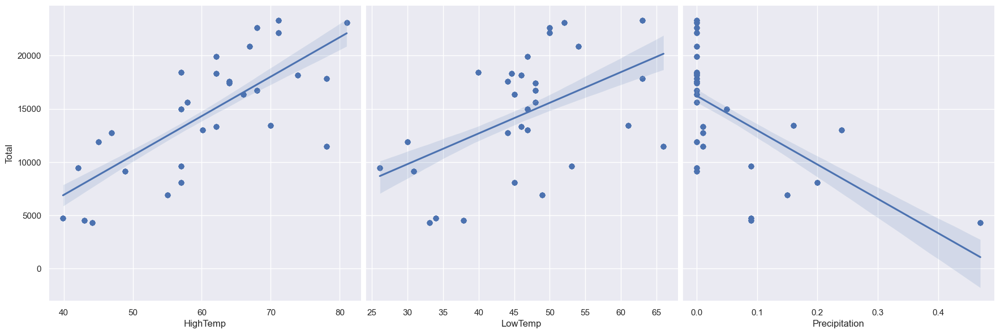
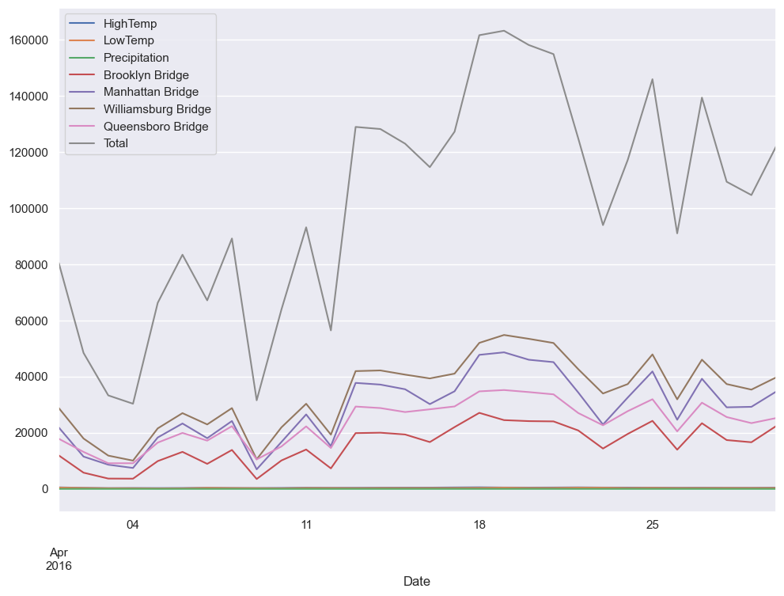
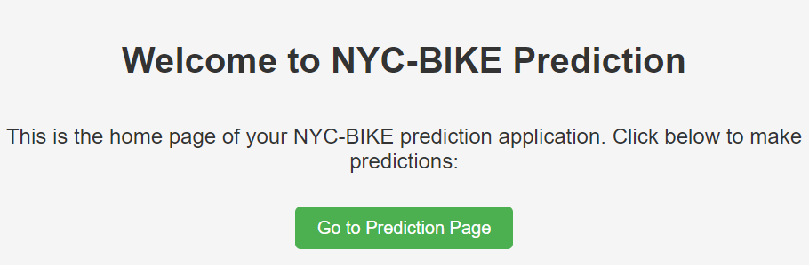
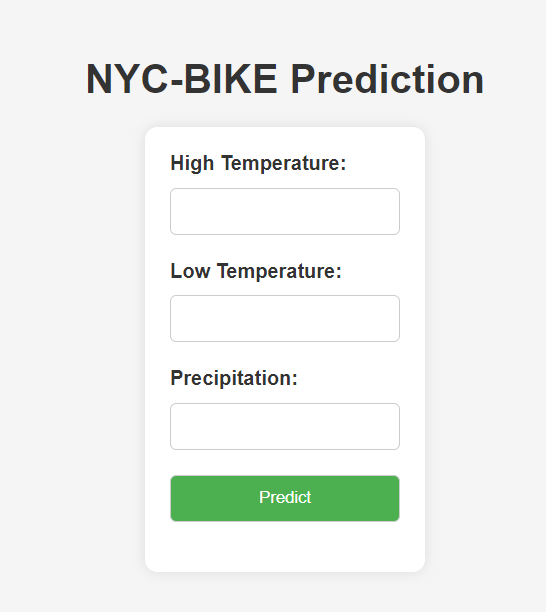

# NYC-BIKE Prediction App

## Business Problem

Aplikasi ini dirancang untuk membantu pengelola lintasan sepeda di New York City dalam mengatasi fluktuasi jumlah lintasan sepeda yang dipengaruhi oleh faktor cuaca. Dengan menggunakan model prediksi, pengelola dapat membuat perkiraan berdasarkan kondisi cuaca yang diantisipasi, memungkinkan mereka untuk mengoptimalkan sumber daya dan meningkatkan efisiensi manajemen lintasan sepeda.

## Tujuan Bisnis

Tujuan bisnis dari aplikasi ini adalah memahami dampak faktor cuaca, seperti suhu dan curah hujan, terhadap jumlah lintasan sepeda di berbagai jembatan di New York City. Dengan pemahaman ini, pengelola lintasan sepeda dapat mengambil keputusan yang lebih baik terkait manajemen fasilitas sepeda, penjadwalan, dan pelayanan berdasarkan prakiraan cuaca.

## Exploratory Data Analysis (EDA)

### Output 1: Pairplot Data Lintasan Sepeda

### Output 2: Sebaran Total Lintasan Sepeda Selama 1 Bulan

## Tampilan Antarmuka Pengguna (UI)

### Halaman Depan Aplikasi

### Halaman Prediksi

